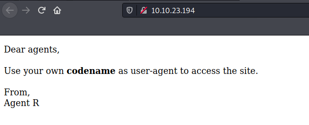

# Agent sudo
[Back to tryhackme page](../index.md)
- --
## Enumeration
Started enumerating machine using Nmap.

3 open ports found. FTP , SSH and HTTP services are running on those ports. 

Website gives some hints.

Tried directory enumeration using gobuster but nothing significant found.

Taking Hint from room page , we have to change User agent to respective code name to get secret page. Using burpsuite we can intercept http request and change user agent. 

> Note : I tried sending request to repeater and checked random words such as agent , agent R but didn't work . Also checking hint suggested to change User agent to "C" but repeater didn't quite work. So checking walkthrough realize that we can simply change it when we intercept http request.

Next clue is revealed.

- --
## Bruteforcing and Steganography
New user called "Chris"  comes into picture now. Also his password is weak. Room page give us hint to bruteforce FTP service. so "Hail Hydra"!! Using hydra tool , I was able to bruteforce into FTP service. "Crystal" is password.

Logged into FTP and got 3 files. 2 pictures of alien like things and 1 Note for agent J.

Reading note for agent J gives hint for steganography .

> Note : I haven't really work on stegnography so I knew only basic so checked walkthrough and many website for help.

Using binwalk I was able to find which file has zip file as stated on website.

On further checking how to extract zip file , I was able to get zip file.

Now its time for John.
Got the hash from zip file

Bruteforcing this hash using john gives us password.

Getting password , I opned Note for agent R.

Gibberish always hints to base64 so decoded it.

Area51 , now it make sense why there are so many alien related reference.
Using this and checking walkthrough , I was able to get message from another picture using steghide tool.

Another user name "James" comes into picture with password already know.
This ofcourse points to SSH login.
- --
## Getting flags
Logging into SSH using james credentials gave command execution.

For root access , we had to exploit sudo version.

Got all flags and completed machine

- --
### Source
- [Walkthrough](https://infosecwriteups.com/agent-sudo-walkthrough-tryhackme-d0abf6f2c6a1)
- [Tryhackme room](https://tryhackme.com/room/agentsudoctf)

> Note for self
> 1. Learn steganography
> 2. Think simple (Repeater vs simple forward thing!!)