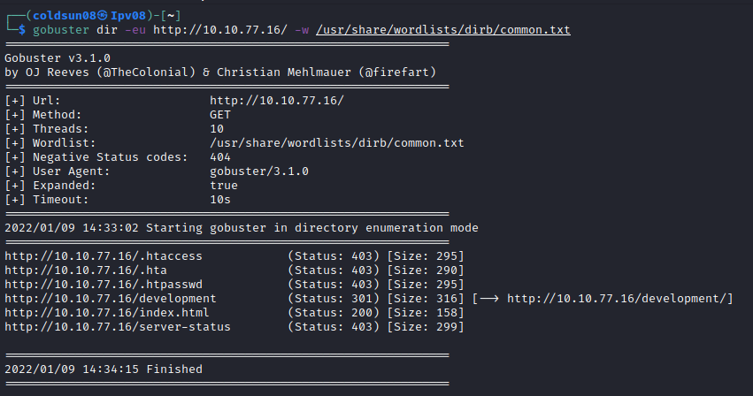
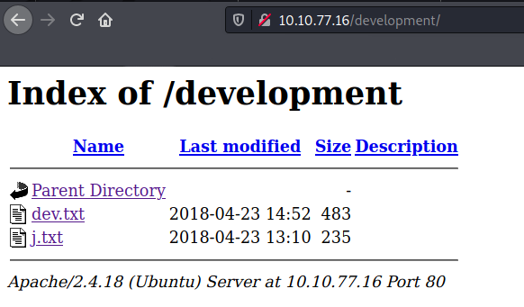
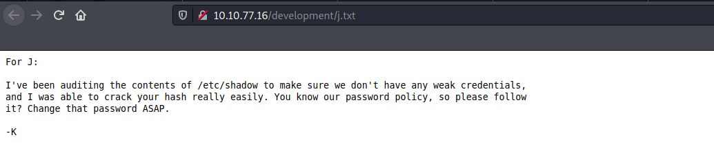
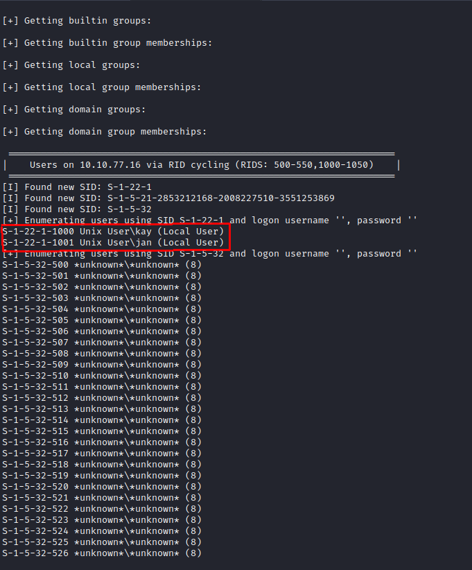
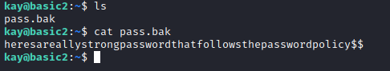

# Basic Pentesting
[Back to Tryhackme page](../index.md)
- --
## Enumeration 
Using Nmap , we found 5 open ports.
Port 22,80,139,8009 & 8080 are open port.

- --
## Website

Website page has hint of dev note section.

Using gobuster , found interesting directory of development.

Two text files found here.

Hint about SMB configuration.

Hind about J and K where J has really easy password.
- --
## SAMBA enumeration
Googled how to enumerate samba , found this [article](https://allabouttesting.org/samba-enumeration-for-penetration-testing-short-tutorial/).

Using enum4linux , got this result.

Kay and jan are two users on system.
- --
## Privilege Escalation
> Note : Started checking walkthrough because got confused with no files.

Found SSH private rsa id for kay

Got hash from rsa id using ssh2john.
Cracking hash got passphrase .

Logged in using passphrase and got password.

- --
### Source
- [Basic Pentesting Room](https://tryhackme.com/room/basicpentestingjt)
- [Walkthrough](https://clearinfosec.com/basic-pentesting-walkthrough-tryhackme/)
