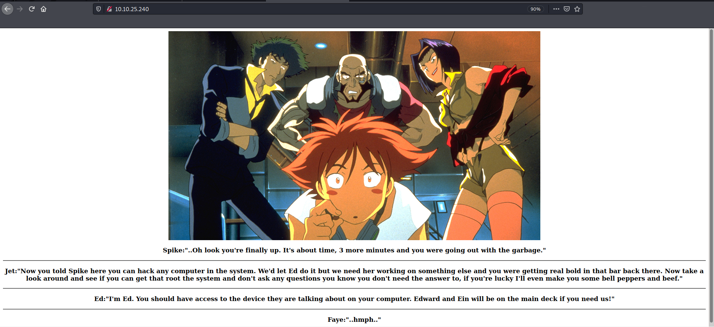
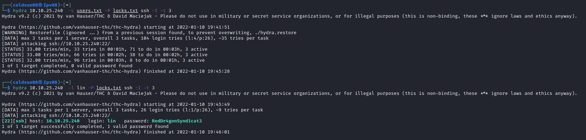

# Bounty Hacker
[Back to Tryhackme page](../Tryhackme.md)
- --
## Starting point
[Bounty hacker](https://tryhackme.com/room/cowboyhacker) is [tryhackme](https://tryhackme.com) room. Room has tags of linux , tar , privesc and security.
- --
## Enumeration
Using nmap , we found 3 open ports. Port 21,22 and 80. 

- --
## Website
Visiting website gave us some story and 4 usernames.

Viewing source file shows nothing special.

Started directory enumeration using gobuster also showed no result.

Images directory was also not interesting.

Nothing interesting found so leaving website end here.
- --
## ftp
Focusing of ftp port now.
Connecting to ftp as anonymous.

We got two files named user.txt and locks.txt

locks.txt is definitely password file.
user.txt shows another username called lin.
- --
## Password cracking
Using hydra , started password bruteforce on ssh port.
Having no idea to start brute force for which user , created user file where I added all possible usernames.
Made mistake here , wrote username with first letter capital so didn't quite work.
After trying lin as user on other terminal found lin is right username.

Password : RedDr4gonSynd1cat3
- --
## SSH
Login SSH , found that user flag was directly located on home path.
- --
## User flag
Got user flag easily.

- --
## Root flag
Checked sudo permission for user and tar has sudo permission
Cheking [gtfobins](https://gtfobins.github.io/gtfobins/tar/#sudo) showed tar exploit for sudo.

Using this gave root permission.
Found root flag.

- --
> Note :
> 1. Write username is right case.

This was my first machine which I solved without any help and hints.

- --
### Source 
- [Bounty Hacker](https://tryhackme.com/room/cowboyhacker)
