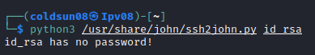

# Brute It
[Back to tryhackme page](../index.md)

---

## Enumeration
Started enumerating machine using nmap. Found 2 open port with ssh and http services running.

Started directory enumeration using gobuster , found admin panel.

Admin page is login form for admin login.

---

## Bruteforcing 
Starting bruteforce attack on admin login page with hydra.

Loggin in as admin gave us John's RSA private key and web flag.

Here is RSA private key.

Getting hash from rsa key.

Cracking hash we got from rsa_id using john.

We got the passphrase for ssh login. Passphrase is "rockinroll".

---

## Login from SSH
Tried loggin in with rsa id but failed.

> Note : Rsa_id permission need to be set as read only. 
>[source](https://docs.rackspace.com/support/how-to/logging-in-with-an-ssh-private-key-on-linuxmac/)

Changing permission gave us ssh shell.

Got user flag.

Got the root flag by exploiting sudo priveleges for cat command.

Although I got root flag , room demand us to brute force root password.
So I got contents of /etc/shadow and /etc/passwd to my machine. Unshadowed it and tried cracking root password. Surprisingly I got root password.

---

### Source
- [Tryhackme room](https://tryhackme.com/room/bruteit)