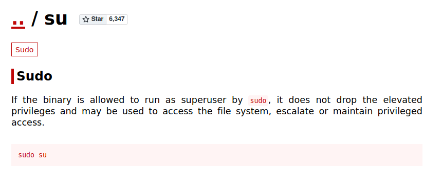

# CC Pentesting
[Back to tryhackme page](../index.md)
- --
## Enumeration
As usual , I will start with enumerating machine for services running on ports.

nmap results clearly shows 2 open ports which are http and ssh. Let's focus on http first.
- --
## Dirctory enumeration
Let's start enumerating directories using gobuster.

/secret/ is interesting directory. It's blank with no content so let's enumerate it further. Also check for specific file extensions such as php and txt

/secret/secret.txt file , definately giving clue here.

so "nyan" is username and next phrase can be password or hash of password.
- --
## Hash cracking
Tried login into ssh with username as nyan and password as other phrase. Didn't quite worked so let's try identifying hash.

So this hash can be SHA-1 hash. Let's try cracking this hash using john the ripper.

So user nyan has password same as nyan. Let's login into ssh using this credentials.
- --
## Getting flags
Login into ssh gives us user flag directly. Also we have sudo access with NOPASS for su command. Checking gtfobins shows us easy way to escalte priviledge.

Got both flags!!🥳
- --
### Source :
- [CC Pentesting](https://tryhackme.com/room/ccpentesting)

