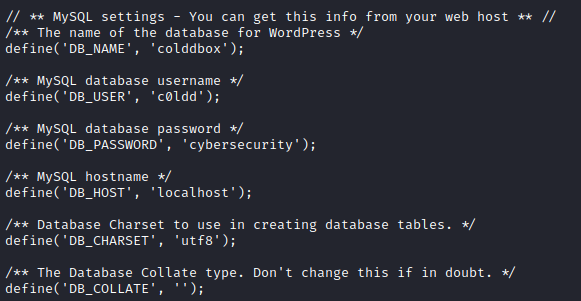

# ColdBox : Easy
[Back to Tryhackme Page](../index.md)

---

## Enumeration

As always , let's start with enumerating machine using Nmap.

Nmap detected only 80 port as open so only HTTP service is running.

---

## Wpscan
Cheching HTTP port, website is hosted by wordpress. So let's enumerate it using Wpscan.

As we can see , we found 3 users on wordpress. 'c0ldd' seems important as it resembles to machines name. Let's try to bruteforce password of c0ldd user using wpscan.

We found password for user c0ldd , it is 9876543210. Let's login into wordpress.

---

## Getting reverse shell

Now we have admin access to wordpress , let's try to get reverse shell. We can get reverse shell using metasploit module wp_admin_shell_upload. But that didn't work in my case as it was showing authentication failure. Googling how to get reverse shell ,this [article](https://www.hackingarticles.in/wordpress-reverse-shell/) mentioned uploading shell in theme's 404 page. 

I uploaded my shell in 404.php.

Now we can access this payload through this cold.thm/wp-content/themes/twentyfifteen/404.php link.

We got reverse shell.

---

## Privilege escalation

I tried many methods of privesc but didn't work. Checking online found that wp-config.php has username and password for database. So checked that file and got password.

Found password for user c0ldd which is cybersecurity.

---

## Flags

Let's switch user to c0ldd. Got user flag.

Now let's check if user has any sudo privileges. 

Sudo vim can be easily exploited , using method mentioned on [gtfobins](https://gtfobins.github.io/gtfobins/vim/#sudo)

Got root flag!!

---

## Source :
- [Wordpress reverse shell](https://www.hackingarticles.in/wordpress-reverse-shell/)
- [Tryhackme Colddbox:Easy room](https://www.tryhackme.com/room/colddboxeasy)