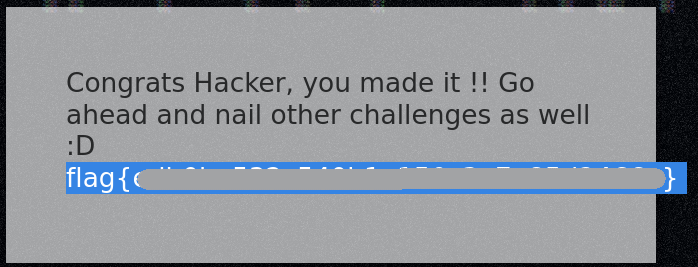

# CyberHeroes
[Back to tryhackme page](../index.md)

---

## Enumeration 
Let's start enumerating machine with nmap. 

There are two open ports , which are SSH and HTTP.

HTTP is first step so lets investigate that.

---

## HTTP 

Let's start burpsuite and capture traffic via proxy. Webpage is well designed. Going to login section as there is nothing interesting on page or source code.

Tried test log in in on login page but it just shows failed popup instead of passing information back to server in any way as there is burpsuite proxy and it will be captured. This means password authentication code is somewhere in page. 

Looking at source code , username and password is passed to onclick function called authenticate(). Code of this function is written just below. 

So username is "h3ck3rBoi". And password is "54321@terceSrepuS" but in reverse.
Reversing string we get password as "SuperSecret@12345".

---

## Flag
Getting flag by loggin in with information we got.

---

### Source :
- [Tryhackme CyberHeros Room](https://tryhackme.com/room/cyberheroes)