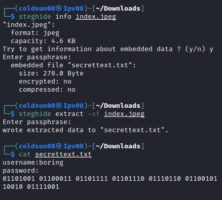

# Easy Peasy
[Back to Tryhackme page](../index.md)

---

## Enumeration
Let's start enumeration of machine using nmap.


Seems only HTTP port is open but that answer is not right. Let's do full port scan for this machine. Starting all port scan and side by side doing enumeration of HTTP port.


So there are 3 open ports (One shows closed). So 2 ports have HTTP and 1 port has SSH service. 

---

## Directory enumeration Port 80
Let's focus on HTTP on port 80 first. Starting with directory enumeration with gobuster tool.


So /hidden is directory we found. Let's check its source code.


Nothing interesting here. Let's further enumerate this /hidden directory.


Enumerating further , I got another directory in hidden directory. So /hidden/whatever is new found directory. Let's check source code of this one too.


Hidden base64 encoded string. Let's decode it.


---

## Directory enumeration Port 65524
Let's start directory enumeration on this port's HTTP using gobuster.


Robots.txt is only interesting file here. Let's check source code of it.


User agent a18672860d0510e5ab6699730763b250 is allowed to access / . I tried enumeration machine with gobuster again with this user agent and nothing significant found here. I checked if this is hash and it is. 


It is md5 hash so tried cracking it with [crackstation](https://crackstation.net/). After some trying around I googled hash and got this [website](https://md5hashing.net/hash/md5/a18672860d0510e5ab6699730763b250) who gave second flag.


---

## Finding flag 3
> Note : Tried finding flag3 but nothing found. Checked [writeup](https://www.aldeid.com/wiki/TryHackMe-Easy-Peasy) at this point. Flag is hidden in source code of home page.


---

## Hidden directory
On same line , there was hidden directory mentioned on page's source code.


We got base encoded string here. 


Tried many base decoding format and base62 decoding gives us directory name. 

---

## Getting password hash
Checking directory gives us password hash.


Cracking this hash using john the ripper and easypeasy.txt as wordlist.


we got password here but where do we use that? I checked again that there is image on website. Let's check if there is anything interesting there.



We got username as boring and binary password hidden in this image.


We got SSH password. Not the best way to store password !

---
## User flag
Let's get user flag. Login into SSH.


Got user flag here.

---
## Root flag
Cron was mentioned for room tag. So let's check crontab.


.mysecretcronjob.sh is cronjob running. It is running with sudo permissions.
We can add this [reverse shell code](https://github.com/swisskyrepo/PayloadsAllTheThings/blob/master/Methodology%20and%20Resources/Reverse%20Shell%20Cheatsheet.md#bash-tcp) to get reverse shell. We can update cronjob. 


Got reverse shell after few seconds.


I checked root flag with this command.
```bash
find / -type f -name *root* 2>/dev/null
```


Got location of root flag and root flag too!

---

### Sources :
- [Easy Peasy Tryhackme](https://tryhackme.com/room/easypeasyctf)