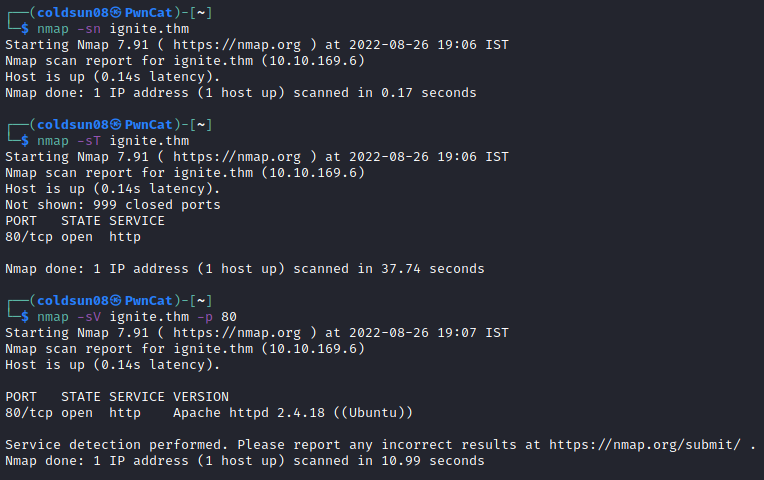
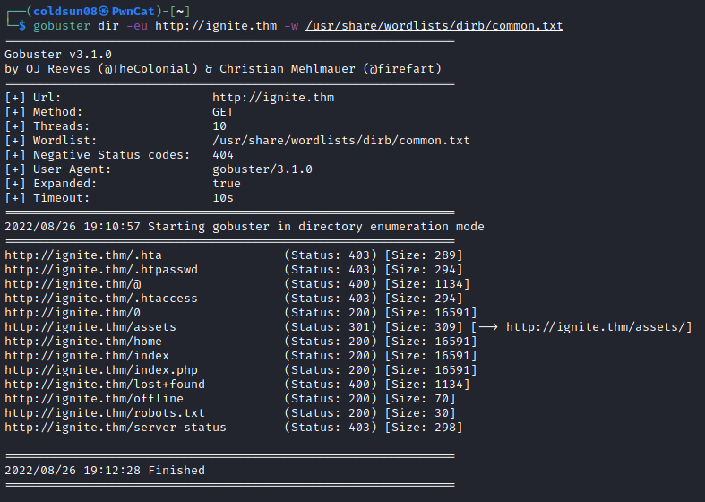

# Ignite
[Back to Tryhackme page](../index.md)

---

## Enumeration

Let's start enumeration of machine using nmap.

There is only 1 open port i.e http. Let's enumerate directories using gobuster.

Every directory is redirecting to 404 page so nothing interesting here.

Checking website , I found there is FUEL cms used. So homepage shows default credentials and got logged in as admin in cms.

There is no content on page other than default so further enumeration has no point.

---

## RCE Exploit 
Quick search on exploit-db shows available [RCE exploits](https://www.exploit-db.com/exploits/50477) for fuel cms version 1.4.1 .
Quickly setting up exploit gave remote code execution. Checking /home directory gives only one user is present with www-data as username. Exploit adds 'system' in front of output from machine.

Now we have to focus on privilege escalation.

---

## PrivEsc
Having admin access , I tried uploading PHP reverse shell but content link was giving 404 error. Tried getting reverse shell in already found exploit but it wasn't connecting. After search , I found [exploit](https://github.com/AssassinUKG/fuleCMS) that gives reverse shell and run it.

Got reverse shell here.
I tried multiple attempts to check privese opportunity but didn't find anything. Chekcing writeup for clue , I forgot to check database present on fuel CMS.

Got database file to my machine as reverse shell was not stable to output this data. 

![fuel database]](fuel%20database.png)

So we got password for root user. It is "mememe" .

---

## Root flag
Switching user as root and using password found , I got root shell.

Got root flag!

---

## Source :
- [Tryhackme Ignite machine](https://tryhackme.com/room/ignite)
- [Fuel RCE Exploit](https://www.exploit-db.com/exploits/50477)
- [FuleCMS reverse shell exploit](https://github.com/AssassinUKG/fuleCMS)
