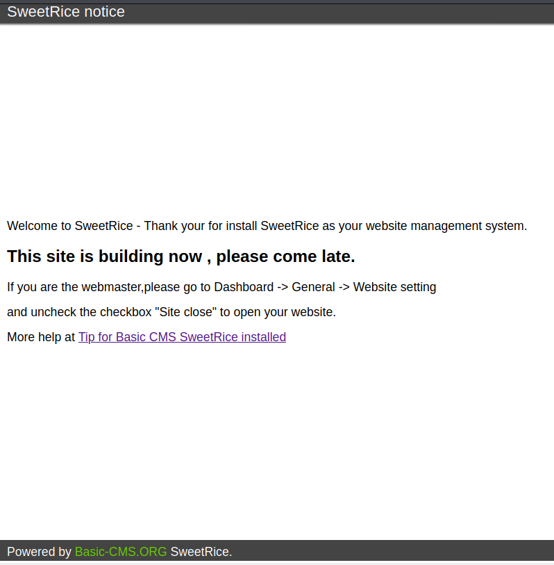
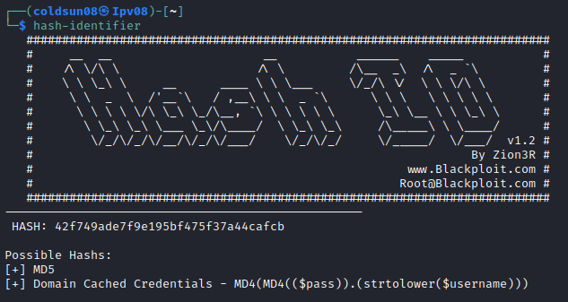

# LazyAdmin
[Back to tryhackme page](../index.md)

---

## Enumeration
Starting with nmap scan. 


So there are only 2 open ports i.e. HTTP and SSH. So let's first focus on HTTP.

---

## Directory enumeration
Now let's start directory enumeration using gobuster.


/content is interesting directory. Let's enumerate this further.



Website is based on sweetrice framework.

Enumerating /content further gives many more directories.


/content/inc directory has  mysql backup.


---

## mysql backup
Downloading file and reading it gives us clue.


There is INSERT comment with username as "manager" and password hash. 


Identifying hash using hash-identifier.



It's an md5 hash so cracking it with john the ripper.


So username is manager and password is Password123. Let's check for any possible exploit for sweetrice framework.

---

## Reverse shell
Searching sweetrice on exploit-db gave us [Unrestricted File Upload exploit](https://www.exploit-db.com/exploits/40716).

Although it showed file uploaded successfully I was not able to get reverse shell for some reason. 


> I checked walkthrough at this point for getting reverse shell
> [Walkthrough](https://medium.com/techiepedia/tryhackme-lazy-admin-walkthrough-afe42873e233)

So I uploaded reverse shell code in ad section and run it.
To run exploit I visited link ```http://$ip/content/inc/ads/shell.php```.


Got reverse shell here.

---

## Getting flags

Got User flag in home directory.


Also we have sudo access for running perl and backup.pl file.
Checking gtfobins gives us command for perl giving root shell but didn't work.
Checking backup.pl file , it runs /etc/copy.sh file which is reverse shell.
So updated code in /etc/copy.sh to reverse shell to me.


Running backup.pl file gave error for sometime and it gave reverse shell but not with root priviledge. Checking another [writeup](https://www.aldeid.com/wiki/CTF-TryHackMe-LazyAdmin) , I ran sudo perl with full path gave me root reverse shell.


Got root flag!!!


---

### Source :
- [LazyAdmin room](https://tryhackme.com/room/lazyadmin)
- [Writeup 1](https://medium.com/techiepedia/tryhackme-lazy-admin-walkthrough-afe42873e233)
- [Writeup 2](https://www.aldeid.com/wiki/CTF-TryHackMe-LazyAdmin)