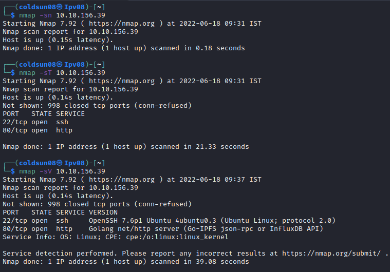
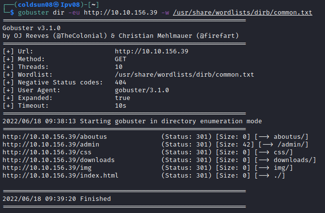
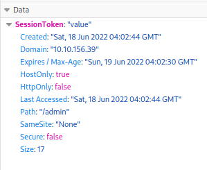

# Overpass
[Back to Tryhackme Page](../index.md)

---

## Enumeration
Starting machine enumeration using nmap.

There are 2 open ports i.e. SSH and HTTP.
Let's focus on HTTP first.

---

## HTTP
Starting directory enumeration using gobuster.

There is admin directory. Let's check that one.

This is admin login page , it passes information to login.js file.

Login js passes information to /api/login point. 

> I tried sql injection , authentication bypass methods but couldn't crack it so I check a [walkthrough](https://youtu.be/qhUKA0t2T8M). 

We have to create a cookie as SessionToken .

and we are logged in . There is private rsa_id key.

---

## Hash cracking
Let's crack password for private key using john.

We got passphrase as "james13".

---

## SSH Login
Let's log into SSH.

We got user flag.

---

## Privilege escalation
Cron tag was mentioned on room so let's check crontab.

So there is cron job that get buildscript.sh from overpass.thm and runs it.
Let's check host file for overpass.thm . We can update it to forward request to our machine.

Let's setup our side now. I created /downloads/src path in my tmp folder. Also created buildscript.sh which gives reverse shell to my machine.

I changed port to 80 so machine can request file.

Now we wait till machine requests our buildscript.sh

---

## Root flag
We got root flag!

---

### Sources :
- [Tryhackme Overpass room](https://tryhackme.com/room/overpass)
- [Walkthrough](https://youtu.be/qhUKA0t2T8M)