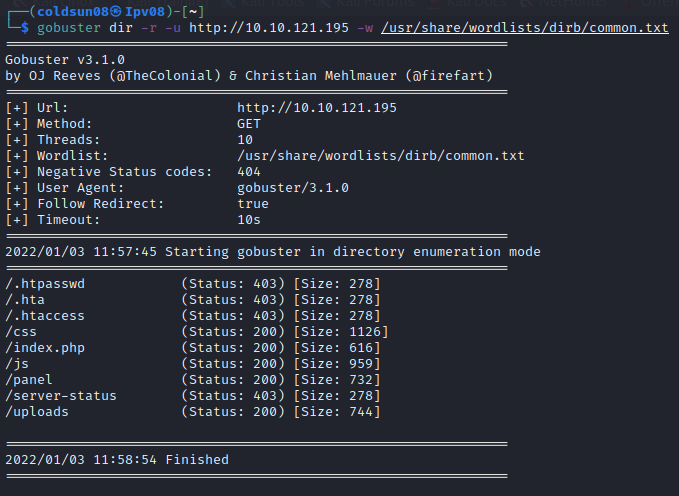

# RootMe
[Backt to Tryhackme page](../index.md)

---

## Enumeration
Using Nmap , we got there are 2 open ports.

---

## Website

Doesn't have any hiddent details. Although PHPSESSID is shown indicating PHP is used in backend.
- --
## Directory Enumeration
Using gobuster , we get 2 directories like panel and uploads.
Panel shows form to upload file.
Uploads shows files uploaded from panels form.

---

## PHP Reverse shell 
Panel can be used to upload file so I cloned [php-reverse-shell](https://github.com/pentestmonkey/php-reverse-shell) repository. 

Tried uploading shell but failed.

Googled how to bypass php and found this on [website](https://vulp3cula.gitbook.io/hackers-grimoire/exploitation/web-application/file-upload-bypass).

Changing .php to .phtml bypassed.

---

## Shell access
Tried running file from opening it through uploads directory.
It gave error.

But surprisingly , I got reverse shell.

- --
## User flag
Found User flag.

- --
## SUID explotation
Tryhackme question specifically asked about SUID so checked for that.

Checked [gtfobins python suid](https://gtfobins.github.io/gtfobins/python/#suid).

I got root access.

- --
## Root flag

- --
### Source
- [RootMe Walkthrough ](https://infosecwriteups.com/tryhackme-rootme-ctf-walkthrough-detailed-a7c521df7339)
- [Php reverse shell code](https://github.com/pentestmonkey/php-reverse-shell/blob/master/php-reverse-shell.php)
- [file upload bypass](https://vulp3cula.gitbook.io/hackers-grimoire/exploitation/web-application/file-upload-bypass)

