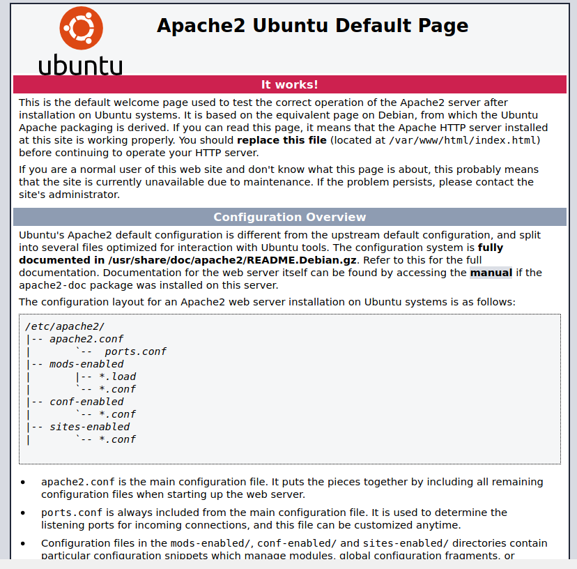
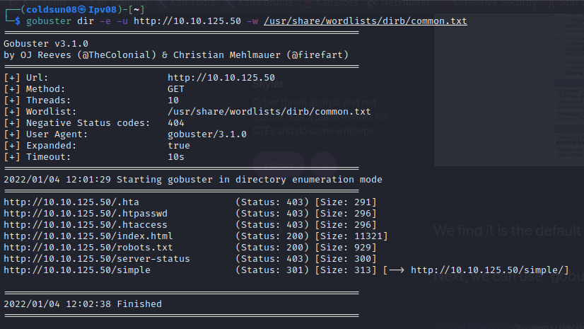

# Simple CTF
[Tryhackme](../Tryhackme.md)
- --
## Enumeration
Started emunerating using nmap.

Note : SSH port was not shown at first but after getting stuck on questions , checked walthrough and found it should be ssh.

3 open ports of ftp , http and ssh.
- --
## ftp
Logged into ftp and found user name "mitch". Also says mitch have very weak password.

- --
## Website

Website doesn't show anything interesting.

Started directory enumaration with gobuster.

Found /simple directory.

- --
## CVE finding
Checked CMS versions and googled for its exploit.

Downloaded file and started exploit.

Note : Script didn't work becuase of my python version. So I checked through walkthrough and got password.
- --
## User flag
Got user flag.

- --
## Root flag
User had sudo privelege for vim.

- --
### Source 
- [Simple CTF walkthrough](https://medium.com/@skylarphenis/tryhackme-simple-ctf-walk-through-e8bb8c8671a9)
- [Exploit-db](https://www.exploit-db.com/exploits/46635)