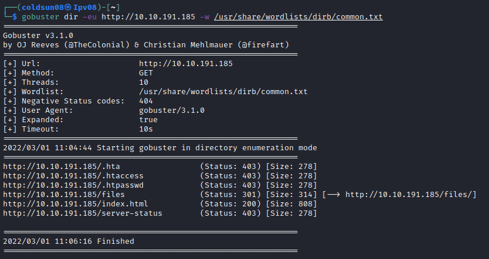

# Startup
[Back to Tryhackme page](../index.md)

---

## Enumeration
Starting with enumeration of machine using nmap. We get 3 open ports which are FTP , HTTP and SSH.

---

## FTP

Let's focus on FTP first. As anonymous login is allowed so log into FTP. There are total 3 files and 1 directory. Let's get all files and examine them one by one.

FTP directory has no content. Let's examine each file.
.test.log just has test and notice.txt has warning about not uploading meme but it is mentioned about user 'maya'. Important.jpg has some compressed data. Let's decode it further.

image has compressed data but it doesn't lead to anything.

---

### HTTP
Let's enumerate directories first.

/files seems interesting directory. Let's check it.

So content is same as FTP. Same files and folders.

> Note : I got stuck here becuase there was no more clue. So checked out official walkthrough as this point. 
> https://youtu.be/3qNxI1OggGc

So HTTP and FTP share same folder ! So I can upload reverse-shell code from FTP and execute it from ftp directory of /file of website.

So now let's get reverse shell.

---

### Reverse Shell & Flags

Getting reverse shell on port 4444.

Immediately we can see recipe.txt file. So got the answer for secret recipe ingredient. 
"Love" is main ingredient. Kinda cheesy line but seen some memes scatter over machines so not surprising. 

/incident is unusual directory. Let's check it. It has file called suspicious.pcapng ! Let's get it on our machine first.

So quick googling tells us pcapng is packet captering file. So here comes wireshark angle. Let's open this file with wireshark.

Okay so someone tried login into www-data account with password. So let's try to login as lennie who's home directory we found first. It works.

Got user flag here! Also there are 2 more directories with scripts and Documents. Documents just content another memes and reference to pain of c++ developer.

Script folder has script and file owned by root. Maybe it is cron job.

Planner.sh file referces to /etc/print.sh file. Let's check that file.

Changing print.sh content to copy root flag in lennies home directory as said in walkthrough. 

So after one minute we got root.txt file copied in lennie's home directory. 
Got root flag!

---

Learnt different way to get reverse shell today. Quite a different room considering other machines I have solved. 

---

### Sources :
- [THM Startup room ](https://tryhackme.com/room/startup)
- [Official Walkthrough video](https://youtu.be/3qNxI1OggGc)