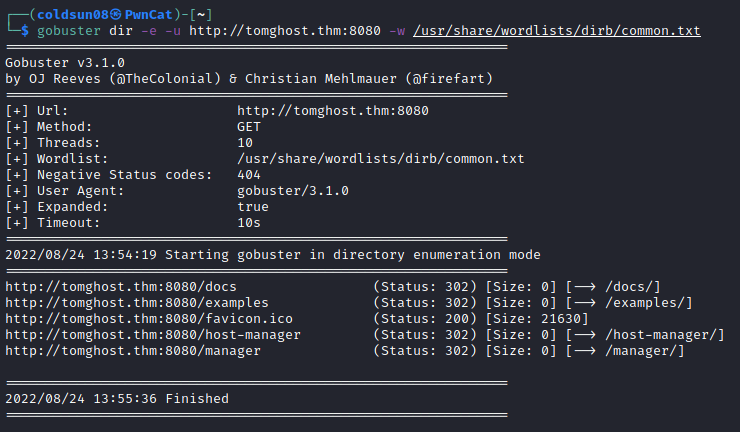
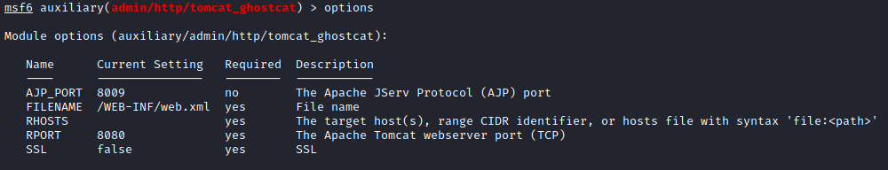
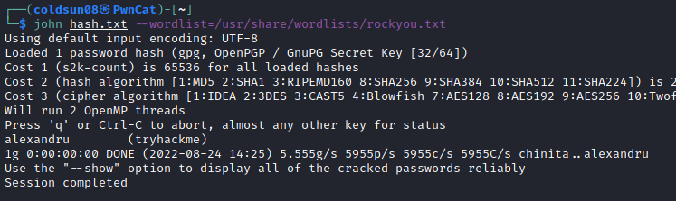

# tomghost
[Back to Tryhackme page](../index.md)

---

## Enumeration

Let's enumerate machine using nmap.

There are 4 open services. SSH on 22 , DNS on 53 , tomcat server on 8080 and [ajp13](https://tomcat.apache.org/connectors-doc-archive/jk2/common/AJPv13.html) on 8009.

Let's investigate http proxy port 8080. Enumerating directories using gobuster.

Nothing interesting hosted on site as it is default page.

---

## CVE-2020-1938
[CVE-2020-1938](https://cve.mitre.org/cgi-bin/cvename.cgi?name=CVE-2020-1938)
Tag on tryahckme machine denotes this CVE so let's try to exploit this one. 
Using metasploit , we first select this exploit and fill all options.

Successfully exploited and got password for skyf\*ck user.

Let's login into machine using SSH credentials found here.
Logging into machine , there are 2 files in home directory tryhackme.asc and credential.pgp . This is pgp encrypted files.

---

## User flag
Further checking users in /home directory , I got user flag stored in merlin's home directory.

---

## Decrypting PGP files

> I searched online on how to work with pgp encrypted files and found some helpful resources which I refered , not a walkthrough.
> https://www.howtogeek.com/427982/how-to-encrypt-and-decrypt-files-with-gpg-on-linux/
> https://linuxhint.com/encrypt-decrypt-with-pgp/
> https://unix.stackexchange.com/questions/184947/how-to-import-secret-gpg-key-copied-from-one-machine-to-another
> https://www.ubuntuvibes.com/2012/10/recover-your-gpg-passphrase-using-john.html

I first extracted hash from tryhackme.asc using gpg2john tool and saved it in hash.txt .

Then I started decrypting hash using JTR tool.

Once I got passphrase , I imported private key and decrypted credential.pgp file

Found credentials for merlin : asuyusdoiuqoilkda312j31k2j123j1g23g12k3g12kj3gk12jg3k12j3kj123j

---

## Root flag

Logging to machine as merlin , user flag was there as found earlier.
Checking sudo permissions for merlin , zip was allowed to run with no password.
Checking gtfobins , I found file read exploit.

Copying and zipping root.txt into file.txt . I should have unzipped to read flag but works anyway .

Got root flag.

---

## Source :
- [Tomghost Tryhackme room](https://tryhackme.com/room/tomghost)