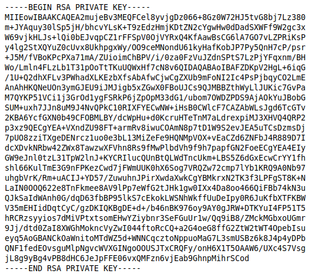
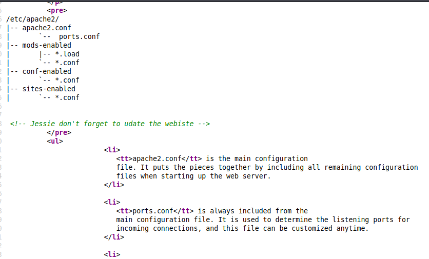

# Wgel
[Back to tryhackme page](../index.md)
- --
## Enumeration
As always , will start with nmap scan.


We can see that there are 2 open ports i.e SSH and HTTP.

Let's start with enumerating directories of website.


sitemap is one of the interesting directory , let's look further into it.


Sitemap has directory called .ssh. This is going to be interesting.
- --
## Getting id_rsa
Checking .ssh directory gives up id_rsa i.e. private key. Now let's check it further.


Downloding this key using wget.



- --
## Solving id_rsa
Now quick googling refreshes memory of using ssh2john. Getting hash from id_rsa.


id_rsa has no password. I think this is some kind of error. Checking it further online found that it is not error but now I am stuck here with no username to login

> Note : Checked [walkthrough](https://yebberdog.medium.com/try-hack-me-wgel-walkthrough-e28b9e7a1d06) here. This reveals that I didn't go through website's code for hint.

Getting username from comment in website.



so jessie is username here.
Logged in into SSH using id_rsa.


- --
## User flag
Lates check user flag first.
Tried searching many combinations of user.txt , user* but didn't get any result.

```
find / -type f -name *.txt 2>/dev/null
```
This gives us flag location.


- --
## Root flag
Now let's search for root flag.

```Sudo -l``` gives us that we have permission to run all commands as all commands can be run as sudo but we don't have password. So let's check privesc via wget which doesn't require password.


Checking [gtfobins wget](https://gtfobins.github.io/gtfobins/wget/#file-read) gives us how to read files.

> Note : Already know that root file is stored in /root/root_flag.txt from walkthrough.


Got root flag here!


- --

> Thing learnt :
> 1. Always check all sources and increase attack surface to get clues
> 2. Google when you think it's error rather than genuine output

- --
### Source
- [Tryhackme wgel](https://tryhackme.com/room/wgelctf)
- [Wgel walkthrough](https://yebberdog.medium.com/try-hack-me-wgel-walkthrough-e28b9e7a1d06)